# MQL-Project-SQL-Queries

SQL queries for world database(countries, city, country language, life expectancy)

MQL queries dataset containing all cabinet level appointments from Washington to 
Trump. It consists of a number of files and tracks information such as the appointee 
name, the position title, information on the history of the position itself (such as year 
established, renamings, etc), whether the appointee served in the military, went to 
college, and whether the appointment was rejected or revised. The files can be 
found at:

https://github.com/taitcha/American_cabinet_appointments/find/master

Loading Positions.csv

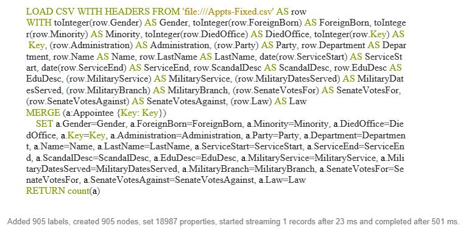

Loading Appintments.csv

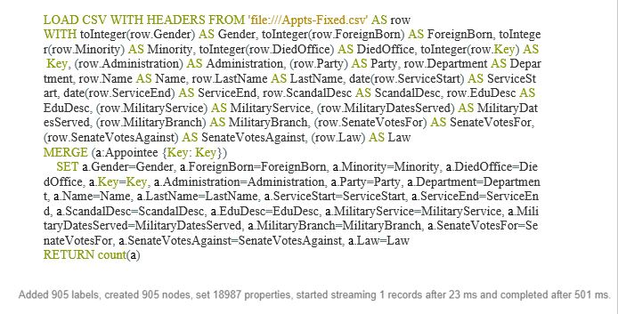

1. return all appointments made in Clinton's administration 

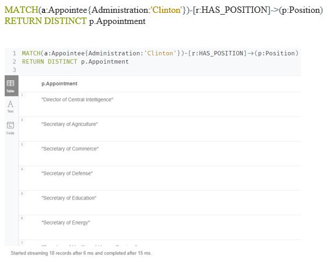

2. return all the name, position, start date, end date, and college for all female 
cabinet appointments

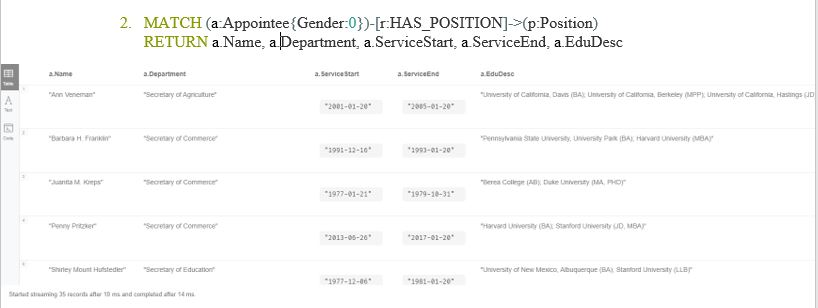

3. return the name, start date and administration for all  postmaster generals from 
1850 to 1950

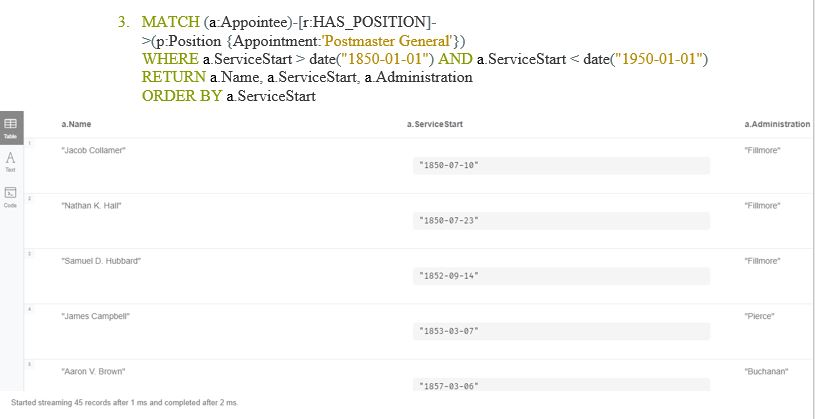

4. return all appointments in positions established after 1990

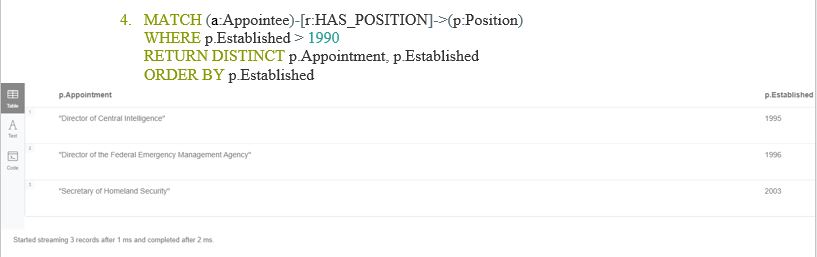

5. Return all appointments in positions that have been renamed

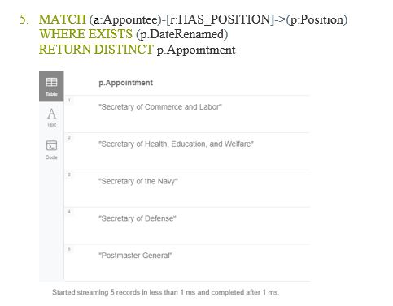

6. Return all appointments and the department name where the position name 
contains LABOR

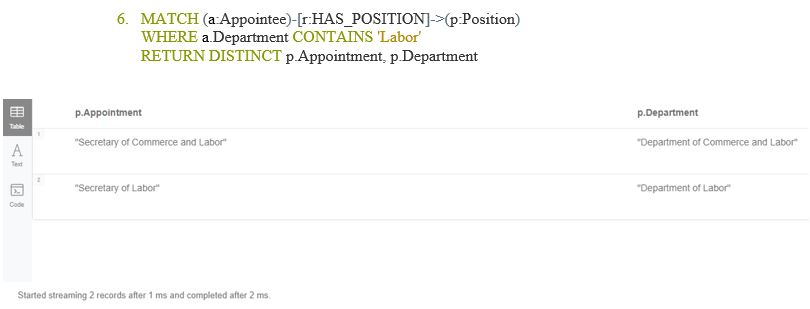

7. return the appointment name, position, administration and year the position was 
established, ordered by the year established

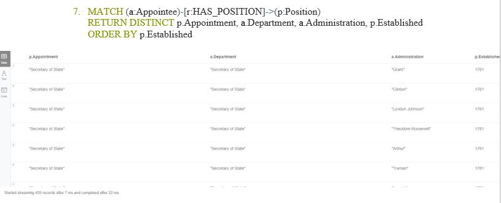

8. return a count of appointments for people who served in the navy 

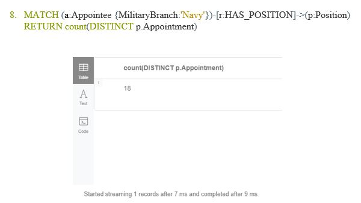

9. return the number of women in appointments grouped by department 

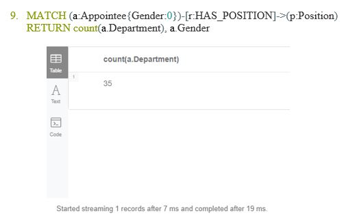

10. Return the number of appointees who served in military grouped by service 
branch 

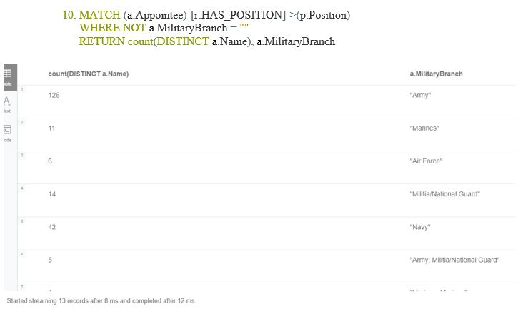

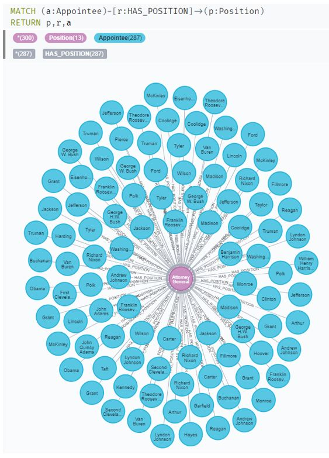

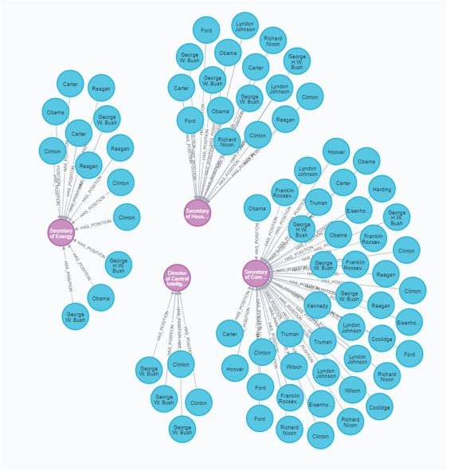

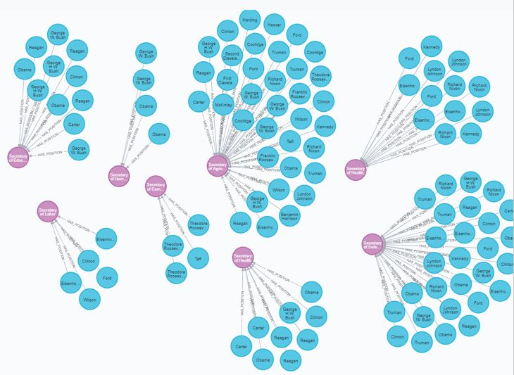

